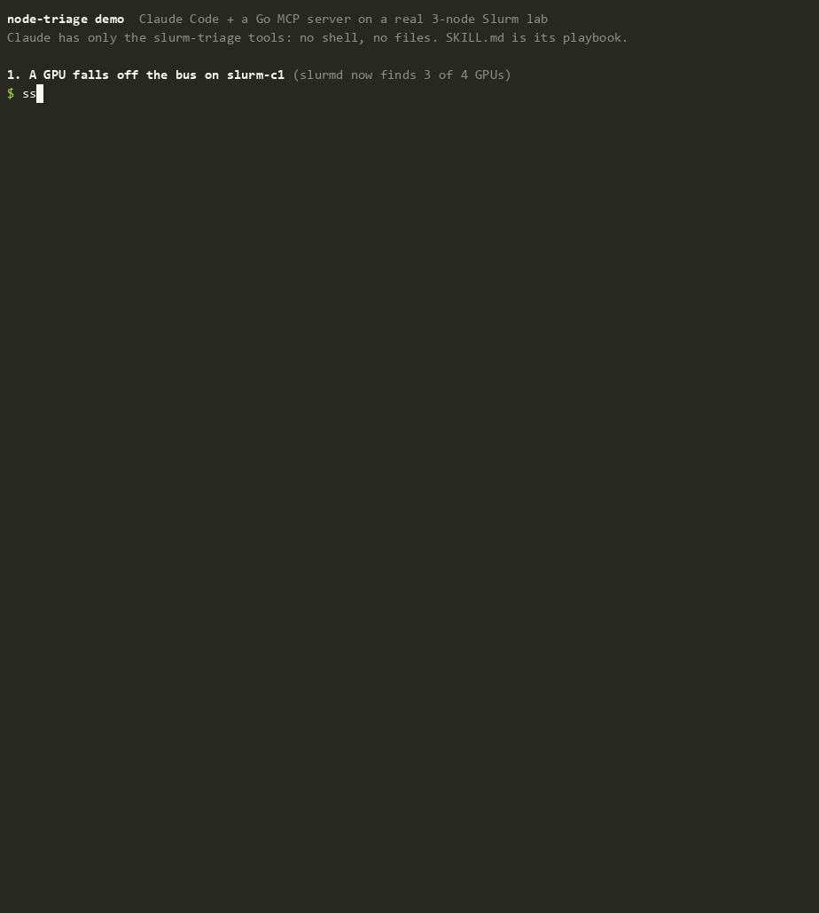

# slurm-k8s-lab

A disposable homelab for learning how GPU clusters are actually operated: classic **Slurm**, a **kubeadm Kubernetes** cluster, **Slurm on Kubernetes** via SchedMD's [Slinky](https://github.com/SlinkyProject/slurm-operator) operator, and a **node-triage MCP server** (Go) that reads both schedulers and recommends what to do with an unhealthy node.

Everything is code. `terraform destroy && terraform apply && ansible-playbook site.yml` rebuilds the lab from nothing, which makes breaking it on purpose cheap.

> Runs on a single Proxmox VE node. There are no real GPUs; GPU scheduling uses **fake GRES devices** (see below). Nothing here hosts a real service.

## Layout

```
terraform/   Proxmox VMs (bpg/proxmox), cloned from a Debian 13 cloud-init template
ansible/     Node configuration: Slurm, and Kubernetes bootstrap (kubeadm, Cilium, Argo CD)
gitops/      What Argo CD manages on the cluster: LB IP pool, storage, CI runner, monitoring, node-problem-detector
triage/      node-triage MCP server (Go)
scripts/     One-time Proxmox bootstrap (pool, template, scoped API token)
```

| VMID | Name | IP | vCPU | RAM | Role |
|------|------|----|------|-----|------|
| 130 | slurm-ctl | 10.0.5.130 | 2 | 3 GiB | slurmctld, slurmdbd, MariaDB, NFS server |
| 131 | slurm-c1 | 10.0.5.131 | 2 | 2 GiB | slurmd, 4 fake GPUs |
| 132 | slurm-c2 | 10.0.5.132 | 2 | 2 GiB | slurmd, 4 fake GPUs |
| 133 | k8s-cp | 10.0.5.133 | 4 | 6 GiB | kubeadm control plane *(phase 2)* |
| 134–135 | k8s-w1/w2 | 10.0.5.134–135 | 4 | 8 GiB | kubeadm workers *(phase 2)* |
| 139 | debian13-lab-template | — | — | — | clone source |

## Roadmap

- [x] **0 — Foundations:** Terraform + Ansible, scoped Proxmox token, template; destroy → apply → converge → verify proven
- [ ] **1 — Classic Slurm:** munge, slurmctld/slurmd, slurmdbd accounting, cgroup v2, fake GPU GRES, `burnin` → `batch` node flow, fairshare/QOS, node health checks, maintenance reservations
- [x] **5 — Node-triage MCP server (Go):** Slurm and Kubernetes (4 read-only tools, opt-in guarded writes; tested on 6 Slurm and 6 Kubernetes captured scenarios)
- [x] **GitOps + CI:** Argo CD (app of apps from `gitops/`, pulled from GitLab over the LAN with a read-only deploy token) owns the add-ons after bootstrap; GitLab CI runs on a Kubernetes-executor runner inside the cluster and `main` requires a green pipeline
- [x] **2 — kubeadm Kubernetes:** v1.36.5 (pinned to Cilium 1.20's tested range, not the newer 1.37), Cilium as kube-proxy replacement + Hubble, Cilium LB-IPAM with L2 announcements on the LAN (`10.0.5.140–149`) instead of MetalLB, local-path storage, `k8s-verify.yml`. kube-prometheus-stack and node-problem-detector (v1.36.0) run as Argo CD apps
- [ ] **3 — Slinky:** Slurm on Kubernetes; the same jobs run on classic and Slinky, with a comparison write-up
- [ ] **4 — Failure drills (ongoing):** node death mid-job, drains, health-check failures, munge/clock faults, cordon + PodDisruptionBudgets, cert expiry

## Usage

Control node: any Linux (or WSL) box with Terraform ≥ 1.9, Ansible core ≥ 2.16 and SSH access to the lab subnet.

### 1. Bootstrap Proxmox (once, as root on the PVE node)

```bash
scp scripts/proxmox-bootstrap.sh root@pve:/root/ && ssh root@pve bash /root/proxmox-bootstrap.sh
```

This creates the `slurm-k8s-lab` pool, the Debian 13 template (VM 139, checksum-verified image) and a `terraform@pve!lab` token. The token's ACLs only reach the pool, the VM datastore, the bridge, and read-only on the node; it has no `Sys.Modify` and nothing at `/`. The secret goes to `/root/slurm-k8s-lab.tfapi` (0600) and is never printed.

### 2. VMs

```bash
cd terraform
cp terraform.tfvars.example terraform.tfvars   # add your SSH public key(s)
export PROXMOX_VE_API_TOKEN="$(ssh root@pve cat /root/slurm-k8s-lab.tfapi)"
terraform init
terraform apply          # writes ../ansible/inventory/hosts.yml
```

`enable_k8s = true` adds the Kubernetes VMs; `started = false` parks the lab without destroying it.

### 3. Configure and verify

```bash
cd ansible
ansible-galaxy collection install -r requirements.yml
ansible-playbook site.yml
ansible-playbook verify.yml
```

For Kubernetes (`enable_k8s = true` in `terraform.tfvars`), `site.yml` also runs kubeadm, joins the workers and installs the add-ons; `ansible-playbook k8s-verify.yml` then proves nodes Ready at the pinned version, no kube-proxy, cluster DNS and ClusterIP through Cilium, a PVC write, and a LoadBalancer IP answering HTTP from off-cluster.

**Kubernetes bootstrap order (fresh cluster):** `site.yml` installs Argo CD, then stops until Argo CD can read the repo. Run the two one-time scripts, then `site.yml` again:

```bash
scripts/register-argocd-repo.sh   # read-only GitLab deploy token -> Argo CD repository Secret
scripts/register-runner.sh        # GitLab runner token -> Secret the runner Application uses
scripts/create-grafana-admin.sh   # random Grafana admin password -> Secret
ansible-playbook site.yml         # applies the root Application; Argo CD syncs gitops/
```

Both scripts pipe tokens from the GitLab API straight into Kubernetes Secrets; nothing lands on disk or in git.

`verify.yml` checks that both computes are idle, a 2-node job runs, `--gres=gpu:fake:2` yields `CUDA_VISIBLE_DEVICES=0,1`, `/shared` is visible from the computes, and `sacct` recorded the jobs.

> **WSL note:** under `/mnt/c` every directory looks world-writable, so Ansible ignores `ansible.cfg` in the current directory. Run with `ANSIBLE_CONFIG=$PWD/ansible.cfg`, or keep a clone on the Linux filesystem.

## node-triage (MCP server)



*Claude Code with only the node-triage tools, on the real lab: a lost GPU is escalated, a resume is refused by the server's hardware guard, and an approved maintenance drain goes through. How it was recorded, and what varies between runs: [`demo/`](demo/README.md).*

`triage/` is a Go MCP server that answers the on-call question *"what should I do with this node?"* for a Slurm cluster and a Kubernetes cluster side by side. Slurm is read through its CLIs' JSON output; Kubernetes through the API server with a least-privilege ServiceAccount (read nodes/pods/events/PDBs, patch nodes for cordon only; `gitops/node-triage`).

| Tool | What it does |
|---|---|
| `triage_cluster` | Assess every node; return the ones needing attention, most severe first |
| `triage_node` | One node: action (`none` / `wait` / `drain` / `resume` / `investigate` / `escalate_hardware`), severity, evidence, preconditions, suggested commands |
| `node_detail` | State, reason and who set it, running jobs, recent job outcomes, drain/down events |
| `list_nodes` | Every node with state flags, CPU and GPU usage |
| `drain_node` / `resume_node` | **Only with `-allow-writes`.** Slurm drain/resume or Kubernetes cordon/uncordon. `resume_node` refuses nodes triage flags as hardware faults unless `force=true` |

The decisions come from deterministic rules in `internal/triage`, not the model, so the same cluster state always gets the same answer and every answer cites the Slurm facts behind it. The LLM client picks what to look at and explains the result. [`skills/triage-slurm-node/SKILL.md`](skills/triage-slurm-node/SKILL.md) tells an agent how to use it and where to stop.

The tests run against **real captures** from this lab. `triage/scripts/capture-scenarios.sh` breaks the Slurm cluster on purpose (health-check drain, maintenance drain with an unbounded job, a lost GPU, slurmd dying mid-job, a host powered off), and `capture-k8s-scenarios.sh` does the same for Kubernetes (a read-only filesystem and a hung task injected into the kernel log for node-problem-detector, a cordon blocked by a PodDisruptionBudget, a stopped kubelet, repeated kernel events). Both save what the scheduler reports and restore the cluster.

```bash
cd triage && make build && cd ../ansible && ansible-playbook triage.yml   # installs on slurm-ctl
# Claude Code: read-only server over SSH (add -allow-writes to enable drain/resume)
claude mcp add --scope user slurm-triage -- ssh -T -o BatchMode=yes -i ~/.ssh/<key> labadmin@10.0.5.130 /usr/local/bin/node-triage
# offline demo against a captured scenario, no cluster needed
go run ./cmd/node-triage -fixtures internal/slurm/testdata/gres-missing -tz America/Denver
```

## Fake GPUs

Each compute node gets `/dev/fakegpu0..3`: character devices on major 240 (reserved for local/experimental use), recreated at boot by `systemd-tmpfiles`. Slurm treats them exactly like `/dev/nvidiaN`: it counts and allocates them per job, sets `CUDA_VISIBLE_DEVICES`, and the cgroup device controller hides the unallocated ones from the job. Opening one returns `ENXIO`, so nothing can actually run a CUDA workload. The scheduling, accounting and isolation behaviour is real; the silicon isn't.

## Secrets

None are stored in this repo. The Proxmox token lives on the PVE node and in your shell environment. The munge key is created on the controller and copied node-to-node through Ansible memory; it never touches the control node's disk. The slurmdbd DB password is generated on first run into `ansible/.secrets/` (gitignored).
