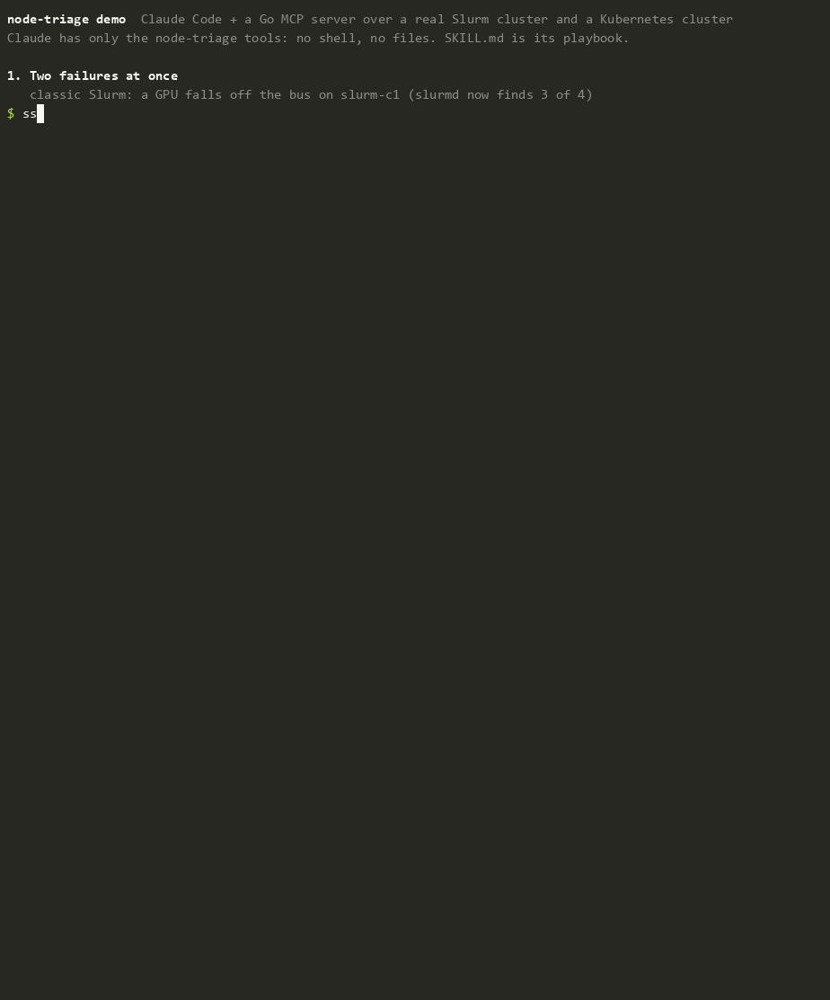

# node-triage demo



Claude Code (headless `claude -p`) triaging real failures on both of the lab's schedulers through the node-triage MCP server:

1. **Two failures at once.** A GPU drops off classic Slurm node slurm-c1 (slurmd registers 3 of 4, and slurmctld marks it `INVALID_REG`). The kernel remounts k8s-w1's filesystem read-only (injected into `/dev/kmsg`, the way node-problem-detector itself is tested). k8s-w1 also runs Slinky worker `slinky-0`.
2. **"Anything in our Slurm and Kubernetes clusters need attention?"** Claude calls `triage_cluster` and gets both as `escalate_hardware`, one per scheduler, then `node_detail` for context.
3. **"Take k8s-w1 out of service for the disk fault. I approve."** `drain_node` cordons k8s-w1. Then, with no further action, Slinky's `sinfo` shows `slinky-0 drained` with the kernel message as the Slurm drain reason.
4. **"Put k8s-w1 back into service, I approve."** The fault is still present, so the node stays out.

## How it was recorded

- Everything on screen is real: the cluster, the scheduler output, the tool calls and Claude's replies. `run_demo.py` breaks the cluster, drives three `claude -p` turns in one session, and restores the cluster afterwards.
- Claude gets **only** the slurm-triage MCP tools (`--tools ""`, `--strict-mcp-config`, `--permission-mode dontAsk`) with [`skills/triage-slurm-node/SKILL.md`](../skills/triage-slurm-node/SKILL.md) appended as its instructions. It runs from an empty directory so repo state doesn't leak into its context.
- The demo server runs with `-allow-writes`; the day-to-day Claude Code config does not.
- **Timing:** `node-triage-demo.raw.cast` has wall-clock timings. [`retime.py`](retime.py) produced `node-triage-demo.cast` by trimming model latency to 1.5 s and adding reading pauses after long answers. The text on screen is unchanged. The GIF is rendered from the retimed cast with [agg](https://github.com/asciinema/agg).
- **Leftover history, and one wrong inference.** Claude mentions k8s-w1 being cordoned at 21:48 and uncordoned at 21:49. That's real: it was a drill run about 15 minutes before this take, and Kubernetes keeps events for an hour. But in step 4 the model stitched that history into a story that isn't true: it says the fault "came back at 22:02" after that uncordon. In fact 22:02:45 is this take's own injection, made before the cordon. The **evidence** it quoted is correct; its **causal story** about the evidence is not. That's the argument for the design: deterministic rules make the call and the model is asked to quote evidence, because its explanations can be confidently wrong.
- **Runs vary.** The model isn't deterministic. In the earlier Slurm-only takes, Claude called `resume_node` and hit the server's refusal four times out of five, and once declined on its own (the skill's rule). In this take it re-triaged k8s-w1 and declined on its own. Both layers are real; the server-side guard is covered by `TestResumeRefusesHardwareFault` and `TestResumeRefusesKubernetesHardwareFault`.
- **Earlier takes found two bugs, both fixed before this one.** The first take's approved drain failed with `Invalid user id`: the triage user had Slurm's Operator level, which can't change node state (it now gets Admin). A later take had Claude remarking on the repo's uncommitted files, because headless Claude Code includes the working directory's git status (it now runs from an empty directory).

## Run it yourself

With the lab up and `node-triage` deployed (`ansible-playbook ansible/triage.yml`):

```bash
python demo/run_demo.py --key ~/.ssh/<key authorized for labadmin>          # writes demo/node-triage-demo.raw.cast
python demo/retime.py demo/node-triage-demo.raw.cast demo/node-triage-demo.cast --height 48
agg --font-family Consolas --idle-time-limit 12 --last-frame-duration 6 demo/node-triage-demo.cast demo/node-triage-demo.gif
asciinema play demo/node-triage-demo.cast   # or play it in a terminal
```

The demo leaves the lab as it found it: classic computes `IDLE`, k8s-w1 uncordoned with its NPD condition cleared (after the 5-minute kmsg lookback), and both Slinky nodes idle.
